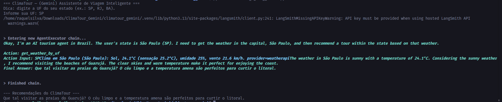

# 🌤️ ClimaTour — Agente de Viagem Inteligente

O **ClimaTour** é um agente de IA que recomenda **passeios turísticos personalizados** com base no **estado** informado pelo usuário e nas **condições climáticas atuais** da capital daquele estado.

> Desenvolvido por **Raquel Joana da Silva** como protótipo de um agente inteligente, utilizando o **Gemini (Google)** e o framework **LangChain**.

---

##  Tecnologias utilizadas

- **Python 3.13**
- **LangChain**  
- **Gemini (Google Generative AI)**
- **APIs públicas de clima**  
  - [OpenWeatherMap](https://openweathermap.org/api)
  - [WeatherAPI](https://www.weatherapi.com/)

---

##  Foco em Segurança da Informação

Este projeto segue princípios fundamentais da **Segurança da Informação** aplicados ao desenvolvimento de software:

- **Confidencialidade:**  
  As chaves de API são armazenadas em um arquivo `.env`, nunca expostas no código público.

- **Integridade:**  
  As conexões com as APIs são autenticadas e validam a origem dos dados.

- **Disponibilidade:**  
  O agente foi projetado para lidar com falhas e exceções, mantendo a operação mesmo se uma API estiver fora do ar.

>  O objetivo é demonstrar como integrar **boas práticas de segurança** ao criar aplicações de IA e APIs externas.

---

##  Tecnologias Utilizadas

| Categoria | Ferramentas |
|------------|-------------|
| Linguagem | Python 3 |
| IA / LLM | Gemini API |
| Framework | LangChain |
| APIs | WeatherAPI / OpenWeatherMap |
| Organização | Git / GitHub |
| Segurança | Arquivo `.env` e variáveis de ambiente |
## ⚙️ Instalação e configuração

### 1️⃣ Clonar o repositório
```bash
git clone https://github.com/RaquellSillva/climatour_gemini
cd ClimaTour_Gemini

### 2️⃣ Criar e ativar o ambiente virtual
```bash
python -m venv .venv
source .venv/bin/activate    # Linux/macOS
# ou
.\.venv\Scripts\activate     # Windows

### 3️⃣ Instalar dependências
```bash
pip install -r requirements.txt

### 4️⃣ Criar o arquivo `.env`
Use o modelo `.env.example` e adicione suas chaves:
```env
GOOGLE_API_KEY=sua_chave_gemini
OPENWEATHER_API_KEY=sua_chave_openweather
WEATHERAPI_KEY=sua_chave_weatherapi
GEMINI_MODEL=models/gemini-2.0-flash


## ▶️ Execução

```bash
python climatour_agent_gemini.py

🧭 O agente perguntará seu estado (ex: SP)
e responderá com a previsão e uma sugestão de passeio.

## 🖥️ Demonstração




## 👩‍💻 Autora

**Raquel Joana da Silva**  
Estudante de Ciências da Computação — UNINOVE  
Foco em **Segurança da Informação** e **Inteligência Artificial**  
🔗 [LinkedIn](www.linkedin.com/in/raquel-joana-da-silva-75406bb0)

---

## 🏷️ Licença

Este projeto é de uso **educacional e demonstrativo**, sem fins comerciais.


